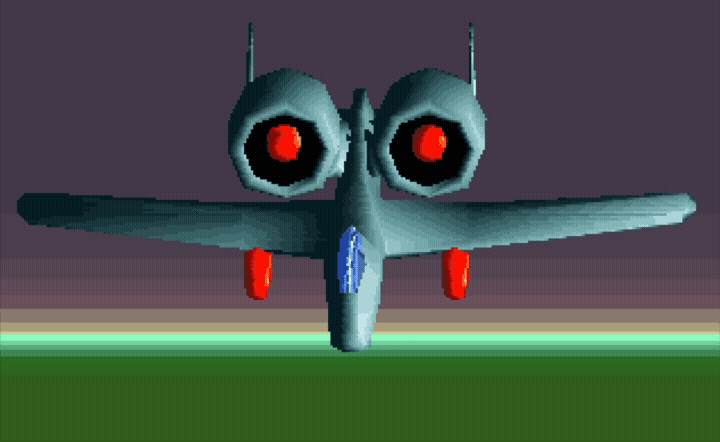

# Dos Fun

A fun little nostalgic project started over the Christmas season to look at DOS and DJGPP/Watcom C, with a main interest in 3D rendering on 320×200 mode 13h VGA. The project targets 486-class hardware with an aim towards 386 compatibility. It's mostly inspired by 90s gouraud renderers that you would find in games like Tie Fighter, or the intro to the DOS version of Cybercon III which had a nice little gouraud rendered figure.

Utilizes the [C89 dynamic array](https://github.com/eteran/c-vector) by Evan Teran.

## Overview



This project explores classic DOS-era 3D graphics programming, focusing on:
- **VGA Mode 13h**: 320×200 resolution with 256 colors
- **Fixed-point mathematics**: For fast 3D calculations without floating-point units
- **Software rendering**: Custom triangle rasterizer with flat shading
- **Performance optimization**: Targeting 486-class CPUs, with 386 compatibility goals

## Thanks
- ray//.tSCc. - For this fascinating [2005 demo coding article](http://alive.atari.org/alive11/frstclip.php) which provided a much better radix sort alternative to qsort() for speeding up the triangle depth pass.
- Chris Egerter's [graphics tutorial](https://www.gamedev.net/tutorials/programming/graphics/gouraud-shaded-polygons-r323/) (October 13, 1994) which I found generally a bit better than the usual guides which overly complicate things.

## Build Scripts

The project includes build scripts for different toolchains and platforms:

### DJGPP (Unix-like systems)

**Shell script** (`build-djgpp.sh`):
- **Usage**: `./build-djgpp.sh [clean|rebuild]`
- **Platforms**: Linux, macOS, and other Unix-like systems
- **Output**: `bin/dmain.exe`

**Batch script** (`build-djgpp.bat`):
- **Usage**: `build-djgpp.bat [clean|rebuild]`
- **Platforms**: Windows/DOS
- **Output**: `bin/dmain.exe`

### Open Watcom (Windows/DOS only)

**Batch script** (`build-watcom.bat`):
- **Usage**: `build-watcom.bat [clean|rebuild]`
- **Platforms**: Windows/DOS
- **Output**: `bin/wmain.exe`
- **Note**: To the author's knowledge, there is no Open Watcom available for macOS, so no shell script is provided for that platform currently.

> ⚠️ **Performance Note**: The OpenWatcom build is noticeably slower than the DJGPP build. The developer would appreciate hints on how to improve this as it's likely the build flags I'm using.

## Environment Variables

The build scripts require the following environment variables to be set:

### DJGPP Builds

- **`DJGPP_ROOT`**: Path to your DJGPP installation directory (e.g., `/opt/djgpp` or `C:\DJGPP`)
- **`DOS_INSTALL_DIR`**: Directory where the compiled executable and assets will be installed (for easy transfer to DOS environment)

### Open Watcom Builds

- **`WATCOM_ROOT`**: Path to your Open Watcom installation directory (e.g., `C:\WATCOM`)
- **`DOS_INSTALL_DIR`**: Directory where the compiled executable and assets will be installed (for easy transfer to DOS environment)

### Example Setup

**On Unix-like systems (bash/zsh):**
```bash
export DJGPP_ROOT="/opt/djgpp"
export DOS_INSTALL_DIR="$HOME/dos-install"
```

**On Windows/DOS:**
```batch
set DJGPP_ROOT=C:\DJGPP
set DOS_INSTALL_DIR=C:\DOS-INSTALL
```

## Building

1. Set the required environment variables for your chosen toolchain
2. Run the appropriate build script:
   - Unix-like: `./build-djgpp.sh`
   - Windows: `build-djgpp.bat` or `build-watcom.bat`
3. The compiled executable and assets will be copied to `DOS_INSTALL_DIR`

### Build Options

- **Default**: Builds the project
- **`clean`**: Removes all build artifacts (object files and executables)
- **`rebuild`**: Cleans and then builds the project

## Running

Copy the contents of `DOS_INSTALL_DIR` to your DOS environment and run:
- `dmain.exe` (DJGPP build)
- `wmain.exe` (Open Watcom build)

The program will display a rotating 3D model in VGA mode 13h. Press any key to exit.

